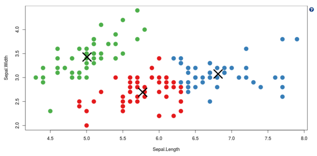

## kmeans Clustering

***
This plot shows the output of performing the kmeans clustering algorithm on the `iris` dataset. You can change the variables being clustered, and the number of clusters to search for, using the inputs on the left hand side.

***
This helpfile has rather more in it that the others, so it requires a larger dialog box to display. You can set the size of dialog boxes by passing the `size` argument to `helper()`.

***
Note we can have any feature of markdown, such as:
* Lists!
* [Links to websites (rstudio)](https://rstudio.com/)
* Text in **bold** and *italics*.

***
If you have image files in your help directory, you can include them in your markdown as well:

